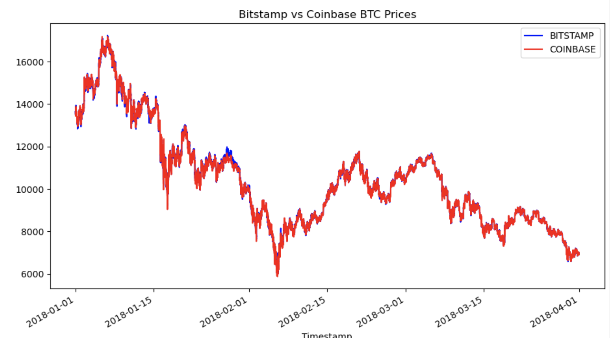
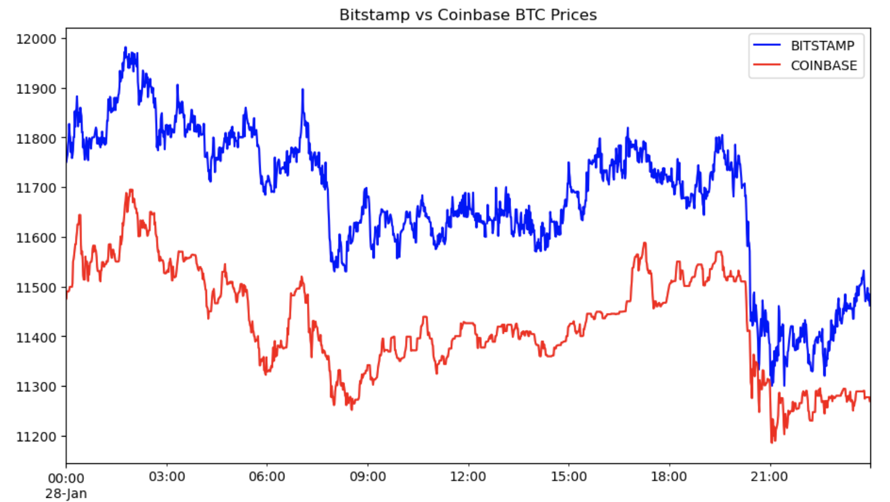
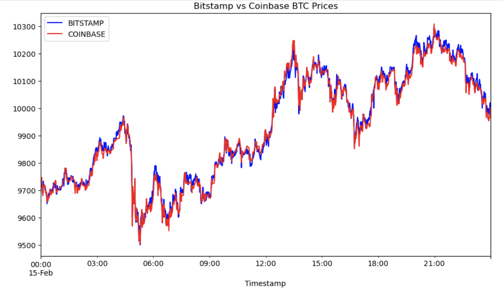
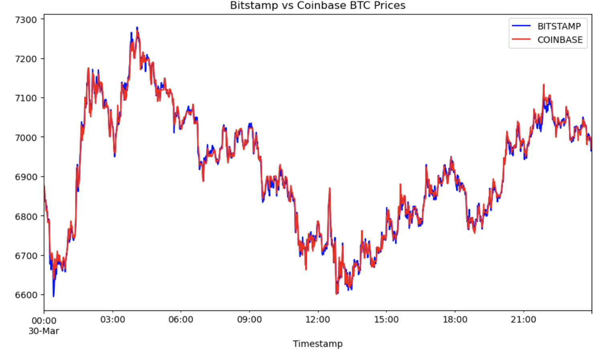
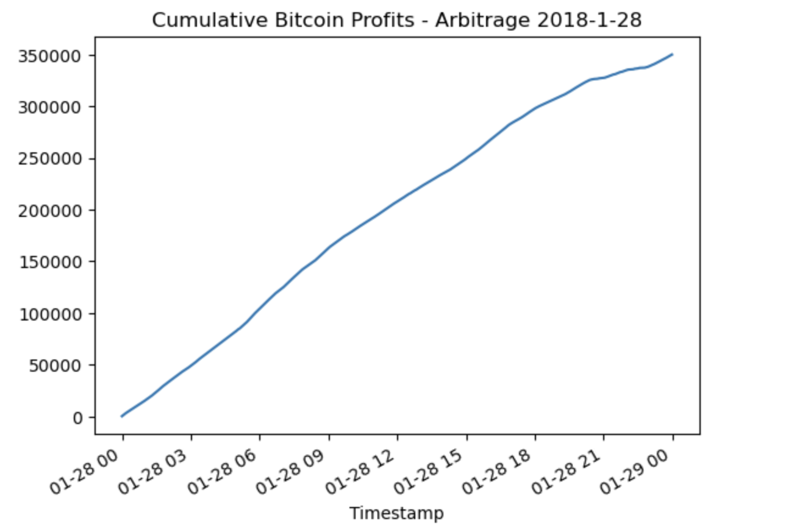
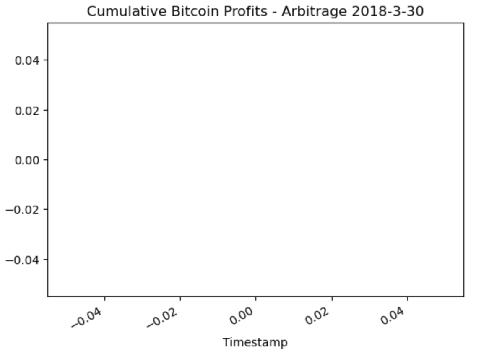
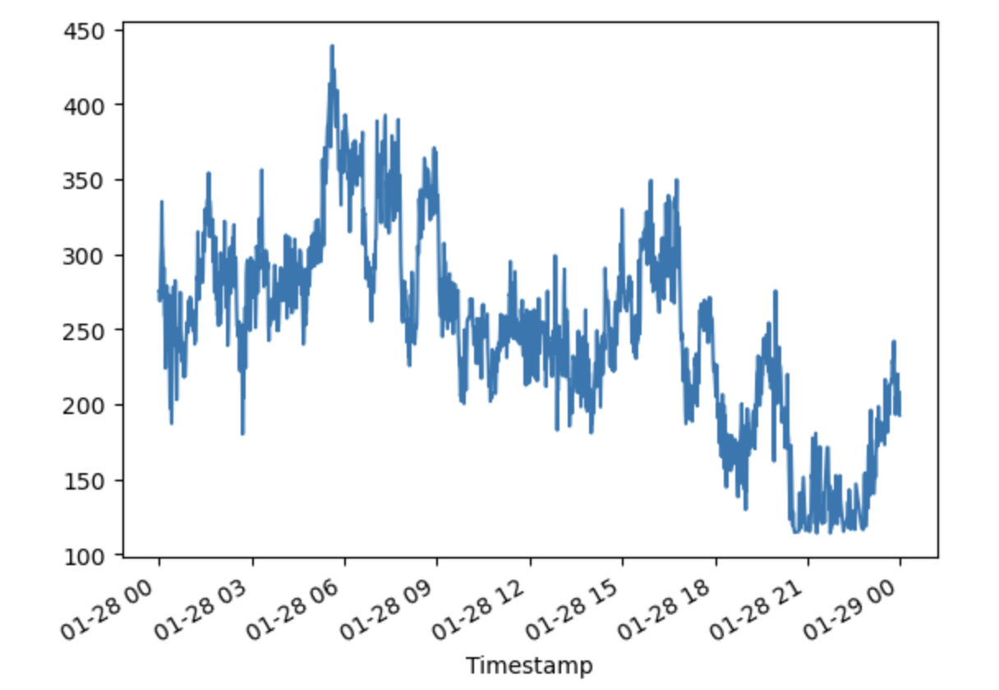

# fintechmodule3challenge

Background
In this Challenge, you'll take on the role of an analyst at a high-tech investment firm. The vice president (VP) of your department is considering arbitrage opportunities in Bitcoin and other cryptocurrencies. As Bitcoin trades on markets across the globe, can you capitalize on simultaneous price dislocations in those markets by using the powers of Pandas?

For this assignment, you’ll sort through historical trade data for Bitcoin on two exchanges: Bitstamp and Coinbase. Your task is to apply the three phases of financial analysis to determine if any arbitrage opportunities exist for Bitcoin.

## Analysis for VP

Q1-2018 data was extracted from two major Bitcoin exchanges, Coinbase & Bitstamp, to analyze arbitrage opportunities to capitalize on them using the Pandas tool.

This report mainly focused on the closing prices of each exchange, and extracted random **early**, **middle** and **late** stage periods to calculate the opportunities of arbitrage.

Based on a detailed analysis, it was noted that a high level of arbritrage was present during the early stages. However, upon further investigation, **these opportunities were short lived and essentially non existent in the short run.**

It is important to note that if these opportunities do exist:
>abritrages are extremely lucrative for potential risk free profits so the company must act upon it as soon as they are detected.>

These can be proven with the potential profit per trade as shown below for our early time period 1-28-2018:

It is recommended that the team seek to create an algorithmic trading progrem that will detect trends and models that might lead to abritrage opportunities. This program should also be able to execute these trades during these opportunities.

------------

## Technologies

This project leverages python 3.7 with the following packages:

*[%matplotlib] (https://pypi.org/project/matplotlib/) -- for creating static, animated, and interactive visualizations in Python.

*[pandas] (https://pandas.pydata.org/) -- for for data analysis and manipulation.

------------

## Contributors

Brought to you by Pshum in the data analytics department

------------

## License

* 2012–2023 The Matplotlib development team.
* Pandas via NumFocus, inc